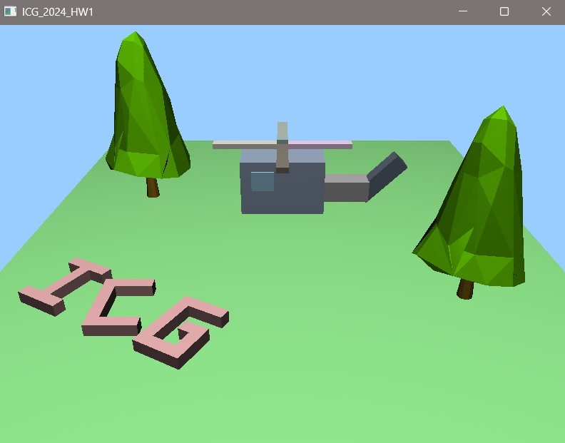
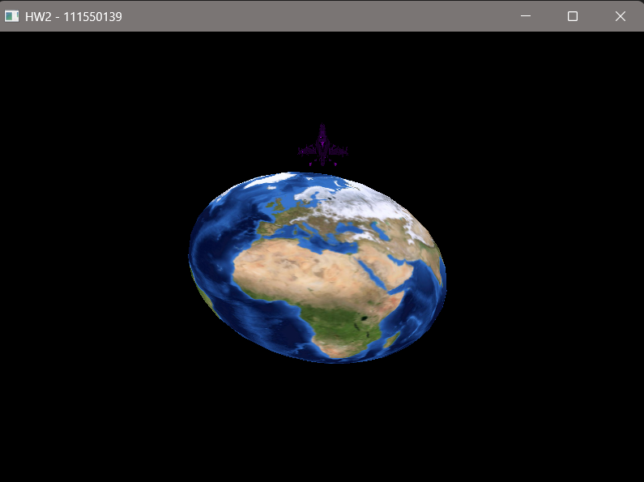
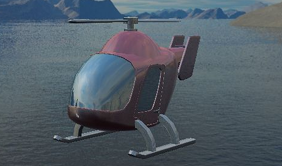

# NYCU-ICG-2024
授課教授：林奕成
## HW0
environment setup and test
## HW1
    

    - init an OpenGL project, setup the camera and models to satisfy the requirement.
    - requirements:
        - models:
            - Ground(cube)
            - tree1 (tree_up + tree_btn)
            - tree2 (tree_up + tree_btn)
            - C
            - I
            - G
            - helicopter(cubes)
        - movements:
            - I and G retate around C as the center
            - helicopter should move according to the user input

## HW2
    

    - use vertex shader and fragment shader to change the shape of earth and the color of airplane
    - requirements:
        - models:
            - earth
            - airplane
            - cube (used to build the helicopter in HW1)
        - movements:
            - press R to change the color of helicopter
            - press S to squeeze the earth
            - the helicopter should rotate around the earth, and change its orbit depends on user input

## HW3

    

    - used vertex shader and fragment shader to change the appearance of the helicopter
    - requirements:
        - Bling-Phong shading
        - Gouraud shading
        - Matellic shading
        - Glass_schlick shading
        - Glass_emprical shading
        - environment cubemap
## HW4 (final project)
link: https://github.com/annguo1106/crazy_santa_claus
